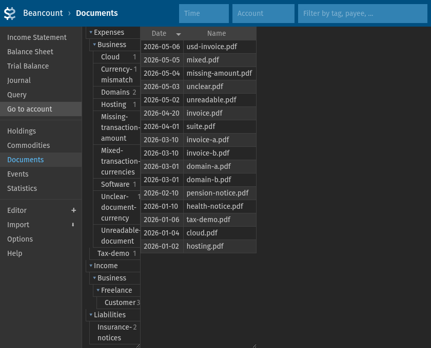

# hledger-document-check

`hledger-document-check` checks hledger transactions against documents on disk.

## Audience

This tool is for anyone who wants to do a document check or voucher audit against
an hledger journal. That can be useful for tax declarations, where relevant
transactions should be backed by filed documents.

The tool supports documents for invoices received and invoices sent to
customers. It can also check whether invoice/document amounts plausibly match the
connected ledger transactions.

## Installation

Required tools:

- [`hledger`](https://hledger.org/) 1.52.1

Optional:

- [`fava`](https://beancount.github.io/fava/) for the example Fava workflow

Download the standalone executable for your platform from the
[latest release](https://github.com/roschaefer/hledger-document-check/releases/tag/latest)
and put it on `PATH`:

```bash
curl -L \
  -o /tmp/hledger-document-check \
  https://github.com/roschaefer/hledger-document-check/releases/download/latest/hledger-document-check-linux-x86_64
install -m 0755 /tmp/hledger-document-check ~/.local/bin/hledger-document-check
```

For macOS on Apple Silicon, use the `hledger-document-check-macos-arm64` asset
instead.

## Usage

### Use it with your own journal and documents

Run the document check against your document folder. If your document folder has
a `hledger-document-check.toml` with a configured journal path, `--documents` is
enough:

```bash
hledger-document-check check --documents path/to/documents
```

Otherwise, pass the journal explicitly:

```bash
hledger-document-check check --journal path/to/hledger.journal --documents path/to/documents
```

To emit a derived journal with `document:` tags, run:

```bash
hledger-document-check enrich-journal --journal path/to/hledger.journal --documents path/to/documents
```

### Run the bundled example

The repository includes a complete example project under `example/`. Run the
document check against it:

```bash
hledger-document-check check --documents example/documents --today 2026-05-20
```

To generate a Beancount file and open it in Fava (requires `hledger` and
`fava` on `PATH`):

```bash
example/rebuild-fava-inputs.sh
hledger-document-check enrich-journal \
  --journal example/journal.journal \
  --documents example/documents \
  --document-tag-root "$(pwd)/example/.generated/fava/documents" \
  | hledger -f - print -O beancount >> example/.generated/fava/example.beancount
fava example/.generated/fava/example.beancount
```

## Full Example

```gherkin
Feature: Full repository example
  The checked-out repository includes a runnable end-to-end example.

  Scenario: The example document check command works
    Given the development dependencies are installed
    When I clone the repository
    And I run `hledger-document-check check --documents example/documents --today 2026-05-20` from the root directory
    Then I see this output:
      """text

      Missing Document Coverage (1):
        2026-04-10  AWS Invoice
          account: Expenses:Business:Hosting:Aws
          amount: 12.34 EUR

      Unbooked Documents (2):
        example/documents/Expenses/Business/Hosting/Aws/unbooked/invoice.pdf
          amount: 12.34 EUR
        example/documents/Income/Business/Freelance/Customer/unbooked/invoice.pdf
          amount: unknown

      Suggested Moves (1):
        High-confidence unbooked document matches by account, amount, and currency.
        2026-04-10  AWS Invoice
          account: Expenses:Business:Hosting:Aws
          amount: 12.34 EUR
          mv {checkout_dir}/example/documents/Expenses/Business/Hosting/Aws/unbooked/invoice.pdf {checkout_dir}/example/documents/Expenses/Business/Hosting/Aws/2026-04-10-invoice.pdf
          mv {checkout_dir}/example/documents/Expenses/Business/Hosting/Aws/unbooked/invoice.document.yml {checkout_dir}/example/documents/Expenses/Business/Hosting/Aws/2026-04-10-invoice.document.yml
          mv {checkout_dir}/example/documents/Expenses/Business/Hosting/Aws/unbooked/invoice {checkout_dir}/example/documents/Expenses/Business/Hosting/Aws/2026-04-10-invoice

      Amount Audit Skips (8):
        document/transaction currency mismatch
          example/documents/Expenses/Business/Currency-mismatch/2026-05-06-usd-invoice.pdf
            accounts/dates: Expenses/Business/Currency-mismatch @ 2026-05-06
        document amount unreadable
          example/documents/Expenses/Business/Unreadable-document/2026-05-02-unreadable.pdf
            accounts/dates: Expenses/Business/Unreadable-document @ 2026-05-02
          example/documents/Expenses/Tax-demo/2026-01-06-tax-demo.pdf
            accounts/dates: Expenses/Tax-demo @ 2026-01-06
          example/documents/Liabilities/Insurance-notices/2026-01-10-health-notice.pdf
            accounts/dates: Liabilities/Insurance-notices @ 2026-01-10
          example/documents/Liabilities/Insurance-notices/2026-02-10-pension-notice.pdf
            accounts/dates: Liabilities/Insurance-notices @ 2026-02-10
        document currencies unclear
          example/documents/Expenses/Business/Unclear-document-currency/2026-05-03-unclear.pdf
            accounts/dates: Expenses/Business/Unclear-document-currency @ 2026-05-03
        transaction amount missing
          example/documents/Expenses/Business/Missing-transaction-amount/2026-05-04-missing-amount.pdf
            accounts/dates: Expenses/Business/Missing-transaction-amount @ 2026-05-04
        transaction currencies mixed
          example/documents/Expenses/Business/Mixed-transaction-currencies/2026-05-05-mixed.pdf
            accounts/dates: Expenses/Business/Mixed-transaction-currencies @ 2026-05-05

      Ambiguous Transaction Groups (1):
        Date-prefixed filenames can only match by account and date.
        These groups have multiple required transactions on the same date in the same account:
        Expenses/Business/Mixed-transaction-currencies @ 2026-05-05  [2 transactions]
          2026-05-05  10.00 EUR  Mixed Transaction Currencies
          2026-05-05  12.00 USD  Mixed Transaction Currencies

      Summary:
        Coverage:
          19/20 transaction groups covered
          1 missing-document placeholders
        Open Items:
          1 missing document coverage
          2 unbooked documents
          0 overdue unbooked documents
          0 unmatched documents
          0 unexpected files
          0 duplicate groups
          0 redundant metadata fields
          0 unresolvable cover metadata fields
        Amount Audit:
          0 amount mismatches
          8 linked groups checked
          8 linked groups skipped
          Skip Reasons:
            4 document amount unreadable
            1 document currencies unclear
            1 transaction amount missing
            1 transaction currencies mixed
            1 document/transaction currency mismatch
      OK.
      """
    And the exit code is 0
```

The Fava example uses `enrich-journal` to add `document:` tags, then converts
the journal to Beancount so Fava can browse transactions together with their
linked PDFs.



Because Fava reads Beancount, account names used with this workflow must follow
Beancount naming conventions. The bundled example uses capitalized account
components such as `Expenses:Business:Hosting`.

```gherkin
Feature: Full repository Fava example
  The checked-out repository includes a runnable Fava integration example.

  Scenario: The example Fava command shows linked documents
    Given the development dependencies are installed
    And the optional Fava dependency is installed
    When I clone the repository
    And I run `example/rebuild-fava-inputs.sh` from the root directory
    And I run a shell command from the root directory:
      """
      hledger-document-check enrich-journal --journal example/journal.journal --documents example/documents --document-tag-root "$(pwd)/example/.generated/fava/documents" | hledger -f - print -O beancount >> example/.generated/fava/example.beancount
      """
    And I start `fava example/.generated/fava/example.beancount` from the root directory
    Then Fava is running at "http://localhost:5000/beancount/documents/"
    And the file "hledger-document-check/example/.generated/fava/example.beancount" contains:
      """text
      option "documents" "{checkout_dir}/example/.generated/fava/documents"
      ...
      ; document:{checkout_dir}/example/.generated/fava/documents/Expenses/Business/Hosting/2026-01-02-hosting.pdf
      """
    And the file "hledger-document-check/example/.generated/fava/documents/Expenses/Business/Cloud/2026-01-04-cloud.pdf" exists
    And the file "hledger-document-check/example/.generated/fava/documents/Expenses/Business/Cloud/2026-01-04-cloud.document.yml" does not exist
```

In the output above, `{checkout_dir}` stands for the path of the cloned repository.

## Specification By Example

Executable specifications in [`specs/`](./specs/) — run them with:

```bash
cargo test --test cucumber
```

Specs:

- [Contract](./specs/01-contract.md)
- [Configuration](./specs/00-configuration.md)
- [Directory and file layout](./specs/02-directory-and-file-layout.md)
- [Special cases with `.document.yml`](./specs/03-document-metadata.md)
- [Amount audit](./specs/04-amount-audit.md)
- [Unbooked invoices](./specs/05-unbooked-invoices.md)
- [Due date](./specs/06-due-date.md)
- [Enrich journal](./specs/07-enrich-journal.md)
- [Full example](./specs/08-full-example.md)

## Development

Development requires a [Rust toolchain](https://rustup.rs/) and
[`hledger`](https://hledger.org/).

Clone the repository and build:

```bash
git clone git@github.com:roschaefer/hledger-document-check.git
cd hledger-document-check
cargo build --release
# binary is at target/release/hledger-document-check
```

Run all tests (unit + integration):

```bash
cargo test
```

## Core Concepts

- Account folders mirror ledger accounts, for example
  `Expenses:Business:Hosting` maps to `documents/Expenses/Business/Hosting/`.
- Matched document files start with `YYYY-MM-DD-`.
- Unbooked documents live in an account-local `unbooked/` subfolder.
- Supporting files live in a sibling directory named after the document stem.
- `*.document.yml` sidecars describe non-trivial relationships, due dates, and
  amount metadata.
- `document_check:` account and posting tags decide which transactions require
  document coverage.
- `hledger-document-check enrich-journal` emits a derived journal with `document:` tags for downstream
  tools such as Fava.

## Check Policy Reference

Checks can be configured as `fail`, `warn`, or `ignore` through CLI flags or the
`[checks]` table in `hledger-document-check.toml`.

Built-in check names:

- `invalid-configuration`
- `missing-document-coverage`
- `unbooked-documents`
- `overdue-unbooked-documents`
- `unmatched-documents`
- `unexpected-files`
- `duplicate-files`
- `amount-mismatches`
- `amount-audit-skips`
- `missing-document-placeholders`
- `ambiguous-transaction-groups`
- `redundant-metadata`
- `unresolvable-cover-metadata`

## Configuration

Project defaults can live in `hledger-document-check.toml` inside the document
root:

```gherkin
Feature: Initial configuration
  Scenario: Generate the initial document-root config
    Given an empty directory named "documents"
    When I run "hledger-document-check init-config --output documents/hledger-document-check.toml"
    Then the exit code is 0
    And the file "documents/hledger-document-check.toml" contains exactly:
      """toml
      [ledger]
      # journal = "../ledger/hledger.journal"

      [documents]
      # root = "."

      [requirements]
      tag_prefixes = []
      # tag_prefixes = ["tax_"]

      [overdue]
      after_days = 14

      [checks]
      invalid-configuration = "fail"
      missing-document-coverage = "fail"
      unbooked-documents = "warn"
      overdue-unbooked-documents = "fail"
      unmatched-documents = "fail"
      unexpected-files = "fail"
      duplicate-files = "fail"
      amount-mismatches = "fail"
      amount-audit-skips = "ignore"
      missing-document-placeholders = "ignore"
      ambiguous-transaction-groups = "warn"
      redundant-metadata = "warn"
      unresolvable-cover-metadata = "warn"

      [enrich_journal]
      # Prefix written into emitted document: tags.
      # Use an absolute path when the consuming tool has no separate document-root setting.
      # document_tag_root = "/absolute/path/to/documents"
      """
```

With that file in place, the normal command can be short:

```bash
hledger-document-check check --documents path/to/documents
```
